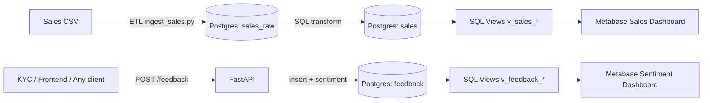

# Architecture

## Services

The solution is fully containerized and orchestrated with **Docker Compose** (`docker-compose.yml`):

| Service | Container | Purpose | Exposed port |
|---|---|---|---|
| PostgreSQL | `afc_postgres` | Stores raw + curated data and analytics views | `5432` |
| FastAPI | `afc_api` | Receives feedback via REST and stores it with sentiment label | `8000` |
| ETL | `afc_etl` | Runs batch ingestion scripts for sales/feedback | (none) |
| Metabase | `afc_metabase` | Dashboards and ad‑hoc analytics | `3000` |

## Data flow (high-level)

1. **Sales (batch)**
   - Sales CSV is loaded into `sales_raw` (raw layer).
   - Then transformed into `sales` (curated layer).
   - SQL views (`v_sales_*`) provide ready-to-use KPIs for dashboards.

2. **Feedback (real-time + batch)**
   - FastAPI endpoint `POST /feedback` receives feedback.
   - A sentiment label is computed with TextBlob and stored in the `feedback` table.
   - SQL views (`v_feedback_*`) provide ready-to-use KPIs for dashboards.
   - (Optional) Batch ingestion is available with `etl/ingest_feedback.py`.

## Layering (raw → curated)

- Raw layer: `sales_raw`
- Curated layer: `sales`, `feedback`
- Reporting layer: SQL views in `db/views.sql`

## Diagram

## Initialization scripts

Postgres automatically executes SQL scripts copied to `/docker-entrypoint-initdb.d` on **first database initialization**:
- `db/schema.sql` creates tables + indexes
- `db/views.sql` creates reporting views

If you need to rerun initialization from scratch, remove volumes (see runbook).
